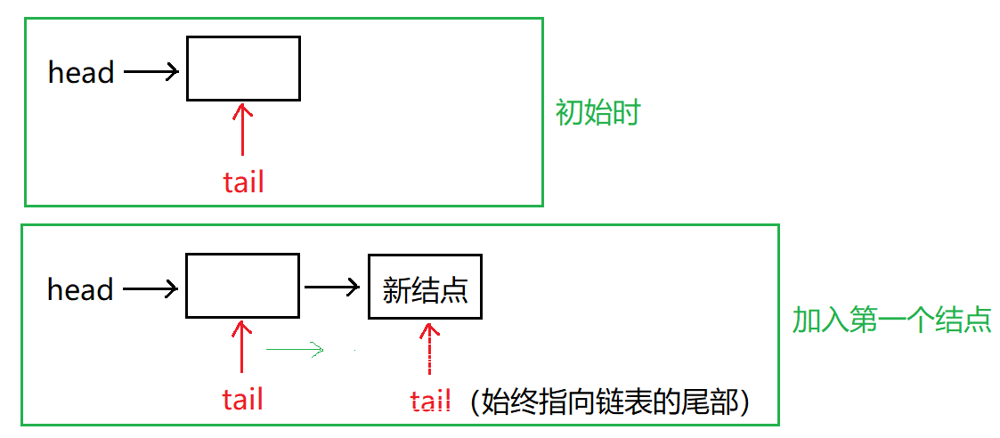
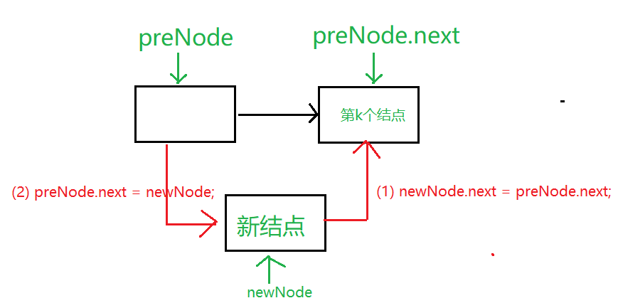
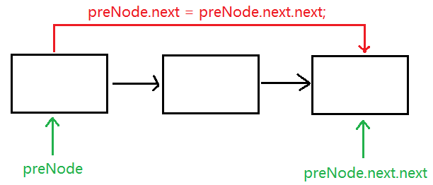

Java中我们使用的ArrayList，其实现原理是数组。而LinkedList的实现原理就是链表了。链表在进行循环遍历时效率不高，但是插入和删除时优势明显。


说明：以下代码是按照自己理解实现，有不正确的地方，请批评指正！！

### 1. 定义结点类

```java
class ListNode {
    int val;
    ListNode next = null;

    ListNode(int val) {
        this.val = val;
    }
}
```


### 2.  建表(尾插法)



```
思路：
头插法建立链表虽然算法简单，但生成的链表中结点的次序和输入的顺序相反。若希望二者次序一致，可采用尾插法建表。该方法是将新结点插入到当前链表的表尾上，为此必须增加一个尾指针tail，使其始终指向当前链表的尾结点。
```

```java
// 1. 创建单链表(尾插法建表)
    public static ListNode createList(int[] arr)
    {
        ListNode head = new ListNode(arr[0]); // 头结点
        ListNode tail = head;
        for (int i = 1; i < arr.length; i++)
        {
            ListNode newNode = new ListNode(arr[i]);
            tail.next = newNode;
            tail = newNode;
        }
        return head;
    }
```


### 3. 打印链表

```java
// 2. 打印链表
    public static void printList(ListNode head)
    {
        while (head != null)
        {
            if (head.next == null)
                System.out.println(head.val);
            else
                System.out.print(head.val + " --> ");

            head = head.next;
        }
    }
// 输出结果: 11 --> 22 --> 33 --> 44 --> 55

```


### 4. 插入结点



```java
	// 3. 在建好的链表中的第k个位置插入一个值为val的结点
   public static ListNode insertNode(ListNode head, int k, int val)
    {
        ListNode preNode = head; // 临时指针,用于指向要插入位置的前一个结点

        if (k < 1)
            return head;
        if (k == 1) // 如果在第一个位置插入(将插在第1个结点之前)
        {
            ListNode newNode = new ListNode(val); // 创建该结点
            newNode.next = preNode;
            head = newNode;

            return head;
        }

        while (k-- > 2) // 使preNode指向第k个位置的前一个结点
        {
            preNode = preNode.next;
        }

        ListNode newNode = new ListNode(val); // 创建该新结点
        // 插入
        newNode.next = preNode.next;
        preNode.next = newNode;

        return head;
    }
```


### 5. 删除结点



```java
// 4. 删除结点(删除第k个结点)
 public static ListNode delNode(ListNode head, int k)
    {
        ListNode preNode = head; // 临时指针,用于指向要删除位置的前一个结点

        if (k < 1) // 不删任何结点
            return head;
        if (k == 1) // 删除第一个结点
        {
            head = head.next; //　将指针往后移动一位就相当于删除了第一个结点
            return head;
        }

        while (k-- > 2) // 使preNode指向第k个结点的前面一个结点
        {
            preNode = preNode.next;
        }
        // 删除结点(通过跳过待删除结点来实现删除结点的效果)
        preNode.next = preNode.next.next;

        return head;
    }
```


### 6. 总代码

```java
class ListNode {
    int val;
    ListNode next = null;

    ListNode(int val) {
        this.val = val;
    }
}

public class Main {
    public static void main(String[] args) {

        int[] arr = {11, 22, 33, 44, 55};
        ListNode head = createList(arr); // 建表

        // 打印链表
        printList(head);

        // 插入
//        //head = insertNode(head, 1, 99); // 在第一个位置插入99
//        head = insertNode(head, 3, 99);  // 在第3个位置插入99
//        printList(head);

        // 删除
        head = delNode(head, 2);  // 删除地2个结点
        printList(head);


    }

    // 1. 创建带头结点的单链表(尾插法建表)
    public static ListNode createList(int[] arr)
    {
        ListNode head = new ListNode(arr[0]); // 头结点
        ListNode tail = head;
        for (int i = 1; i < arr.length; i++)
        {
            ListNode newNode = new ListNode(arr[i]);
            tail.next = newNode;
            tail = newNode;
        }
        return head;
    }

    // 2. 打印链表
    public static void printList(ListNode head)
    {
        while (head != null)
        {
            if (head.next == null)
                System.out.println(head.val);
            else
                System.out.print(head.val + " --> ");

            head = head.next;
        }
    }


    // 3. 在建好的链表中的第k个位置插入一个值为val的结点
    public static ListNode insertNode(ListNode head, int k, int val)
    {
        ListNode preNode = head; // 临时指针,用于指向要插入位置的前一个结点

        if (k < 1)
            return head;
        if (k == 1) // 如果在第一个位置插入(将插在第1个结点之前)
        {
            ListNode newNode = new ListNode(val); // 创建该结点
            newNode.next = preNode;
            head = newNode;

            return head;
        }

        while (k-- > 2) // 使preNode指向第k个位置的前一个结点
        {
            preNode = preNode.next;
        }

        ListNode newNode = new ListNode(val); // 创建该新结点
        // 插入
        newNode.next = preNode.next;
        preNode.next = newNode;

        return head;
    }


    // 4. 删除结点(删除第k个结点)
    public static ListNode delNode(ListNode head, int k)
    {
        ListNode preNode = head; // 临时指针,用于指向要删除位置的前一个结点

        if (k < 1) // 不删任何结点
            return head;
        if (k == 1) // 删除第一个结点
        {
            head = head.next; //　将指针往后移动一位就相当于删除了第一个结点
            return head;
        }

        while (k-- > 2) // 使preNode指向第k个结点的前面一个结点
        {
            preNode = preNode.next;
        }
        // 删除结点(通过跳过待删除结点来实现删除结点的效果)
        preNode.next = preNode.next.next;

        return head;
    }

}
```

