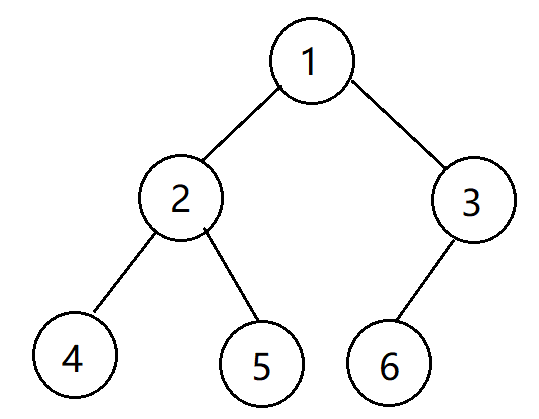

## Java实现二叉树

### 1. 定义结点类

```java
public class TreeNode {
        int val = 0;
        TreeNode left = null;
        TreeNode right = null;
    
        public TreeNode(int val) {
            this.val = val;
        }
    }
```

### 2. 构建二叉树



```java
public static TreeNode createBT(int[] arr, int i) // 初始时,传入的i==0
{
	TreeNode root = null; // 定义根节点

	if (i >= arr.length) // i >= arr.length 时,表示已经到达了根节点
		return null;

	root = new TreeNode(arr[i]); // 根节点
	root.left = createBT(arr, 2*i+1); // 递归建立左孩子结点
	root.right = createBT(arr, 2*i+2); // 递归建立右孩子结点

	return root;
}
```


### 3. 遍历二叉树

#### 3.1 先序遍历

```java
// 先序遍历
    public static void PreOrder(TreeNode root)
    {
        if (root == null)
            return;
        System.out.print(root.val+" ");
        PreOrder(root.left);
        PreOrder(root.right);
    }
```


#### 3.2 中序遍历

```java
// 中序遍历
    public static void InOrder(TreeNode root)
    {
        if (root == null)
            return;
        InOrder(root.left);
        System.out.print(root.val+" ");
        InOrder(root.right);
    }
```


#### 3.3 后序遍历

```
// 后序遍历
    public static void PostOrder(TreeNode root)
    {
        if (root == null)
            return;
        PostOrder(root.left);
        PostOrder(root.right);
        System.out.print(root.val+" ");
    }
```


### 4. 总代码

```java
package com.BinaryTree;

// 定义(链式存储)二叉树结点
class TreeNode {
     int val;
     TreeNode left;
     TreeNode right;
     TreeNode(int x) { val = x; }
}

public class Main {
    public static void main(String[] args) {
        int[] arr = {1, 2, 3, 4, 5, 6};
        TreeNode root = createBT(arr, 0);

        System.out.println("先序遍历：");
        PreOrder(root);

        System.out.println("\n中序遍历：");
        InOrder(root);

        System.out.println("\n后序遍历：");
        PostOrder(root);
    }

    // 使用一维数组建树(利用性质:在一维数组中, 第i个结点的左孩子结点是第2*i+1个结点, 第i个结点的右孩子结点是第2*i+2个结点)
    public static TreeNode createBT(int[] arr, int i)
    {
        TreeNode root = null; // 定义根节点

        if (i >= arr.length) // i >= arr.length 时,表示已经到达了根节点
            return null;

        root = new TreeNode(arr[i]); // 根节点
        root.left = createBT(arr, 2*i+1); // 递归建立左孩子结点
        root.right = createBT(arr, 2*i+2); // 递归建立右孩子结点

        return root;
    }

    // 先序遍历
    public static void PreOrder(TreeNode root)
    {
        if (root == null)
            return;
        System.out.print(root.val+" ");
        PreOrder(root.left);
        PreOrder(root.right);
    }

    // 中序遍历
    public static void InOrder(TreeNode root)
    {
        if (root == null)
            return;
        InOrder(root.left);
        System.out.print(root.val+" ");
        InOrder(root.right);
    }

    // 后序遍历
    public static void PostOrder(TreeNode root)
    {
        if (root == null)
            return;
        PostOrder(root.left);
        PostOrder(root.right);
        System.out.print(root.val+" ");
    }

}

/* 运行结果：

先序遍历：
1 2 4 5 3 6 
中序遍历：
4 2 5 1 6 3 
后序遍历：
4 5 2 6 3 1 

*/

```

