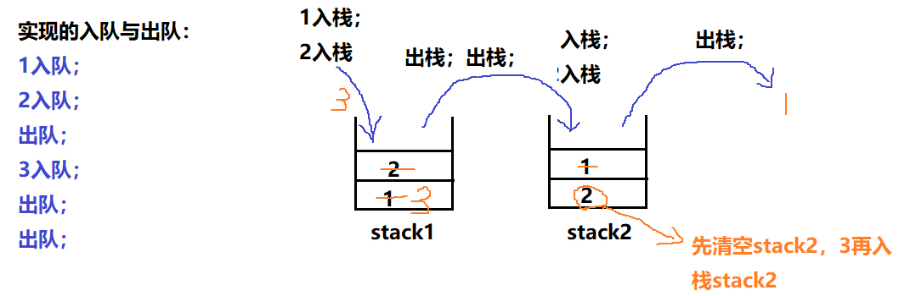

## 用两个栈实现队列(关键：对于stack2要全部清空后才允许进栈(全部弹出))

> 题目：用两个栈来实现一个队列，完成队列的Push和Pop操作。 队列中的元素为int类型。

### 1.自己实现(牛客网通过)



```java
import java.util.Stack;

public class Demo03 {
    static Stack<Integer> stack1 = new Stack<Integer>();
    static Stack<Integer> stack2 = new Stack<Integer>();
    public static void main(String[] args) {
        push(1);
        push(2);

        int p = pop();
        System.out.println(p); // 1出队

        push(3);

        p = pop();
        System.out.println(p); // 2出队

        p = pop();
        System.out.println(p); // 3出队
    }

    public static void push(int node) {
        stack1.push(node);
    }

    public static int pop() {
        int node2;
        while (!stack2.isEmpty()) //关键：对于stack2要全部清空后才允许进栈(全部弹出)
            return stack2.pop();

        while (!stack1.isEmpty())
        {
            node2  = stack1.pop();
            stack2.push(node2);
        }
        return stack2.pop();
    }
}

```


### 2.别人的实现方法

```java
链接：https://www.nowcoder.com/questionTerminal/54275ddae22f475981afa2244dd448c6?answerType=1&f=discussion
来源：牛客网
/*
push时间复杂度：O(1)
pop空间复杂度：O(1)
*/

import java.util.Stack;
public class Solution {
    Stack<Integer> stack1 = new Stack<Integer>();
    Stack<Integer> stack2 = new Stack<Integer>();
 
    public void push(int node) {
        stack1.push(node);
    }
 
    public int pop() {
        if (stack2.size() <= 0) {
            while (stack1.size() != 0) {
                stack2.push(stack1.pop());
            }
        }
        return stack2.pop();
    }
}
```


