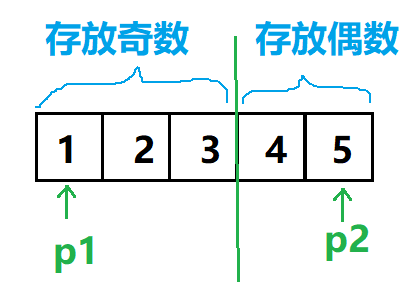

## 题目描述

输入一个整数数组，实现一个函数来调整该数组中数字的顺序，使得所有的奇数位于数组的前半部分，所有的偶数位于数组的后半部分，并保证奇数和奇数，偶数和偶数之间的相对位置不变。



```
思路：

分成两步：

(1) 交换元素，使奇数在左部分，偶数在右部分(此时奇数部分和偶数部分都是无序的)。使用两个指针p1和p2，开始时，分别指向数组的头和尾；向右移动p1，直到遇到第一个偶数为止；然后向左移动p2，直到遇到第一个奇数为止；交换此时p1和p2指向的元素。重复上述操作，直到p1和p2重合为止。

(2)分别对奇数部分和偶数部分排序。

```


```java
// 自己代码, 牛客网通过
public class Solution {
    public void reOrderArray(int [] array) {
        int p1 = 0, p2 = array.length - 1; // 数组前部分存放奇数, 后部分存放偶数
        while (p1 < p2)
        {
            while ((array[p1] & 1) == 1 && (p1 < p2)) // 找到第一个偶数则停下
                p1++;
            while ((array[p2] & 1) == 0 && (p1 < p2)) // 找到第一个奇数则停下
                p2--;

            // 交换
            if (p1 < p2)
            {
                array[p1] ^= array[p2];
                array[p2] ^= array[p1];
                array[p1] ^= array[p2];
            }
        }

        BubbleSort(array, 0, p1); // 先对前部分排序
        BubbleSort(array, p1, array.length); // 再对后部分排序
    }
    
    // 冒泡排序, begin和end表示开始和结束位置的下标
    public void BubbleSort(int[] arr, int begin, int end)
    {
        int i,j;
        for(i = 0; i < end; i++) // 不管是对整个数组排序，还是仅对数组的后半部分排序，i始终是从0开始
            for(j = begin; j < end - i - 1; j++)
                if(arr[j] > arr[j+1])
                {
                    arr[j] ^= arr[j+1];
                    arr[j+1] ^=  arr[j];
                    arr[j] ^= arr[j+1];
                }
    }
    
    
}
```

