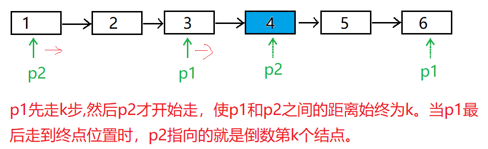

## 题目描述

输入一个链表，输出该链表中倒数第k个结点。




```
解题思路(只需要遍历1次链表)：定义两个指针p1和p2。p1先走k步,然后p2才开始走，使p1和p2之间的距离始终为k。当p1最后走到终点位置时，p2指向的就是倒数第k个结点。

```


```java
// 自己代码，牛客网通过
/*
public class ListNode {
    int val;
    ListNode next = null;

    ListNode(int val) {
        this.val = val;
    }
}*/
public class Solution {
    public ListNode FindKthToTail(ListNode head,int k) {
         
        if(head == null || k == 0) // 鲁棒性是解决该题的关键，注意考虑到所有可能的情况
            return null;
        
         ListNode p2 = head;
         ListNode p1 = head;
         while(k-- > 0)
         {
             if(p1 == null) // 如果k的值超过了整个链表的长度
                 return null;
             p1 = p1.next;
         }
             
        
         while(p1 != null)
         {
             p1 = p1.next;
             p2 = p2.next;
         }
         return p2;
         
    }
}
```

