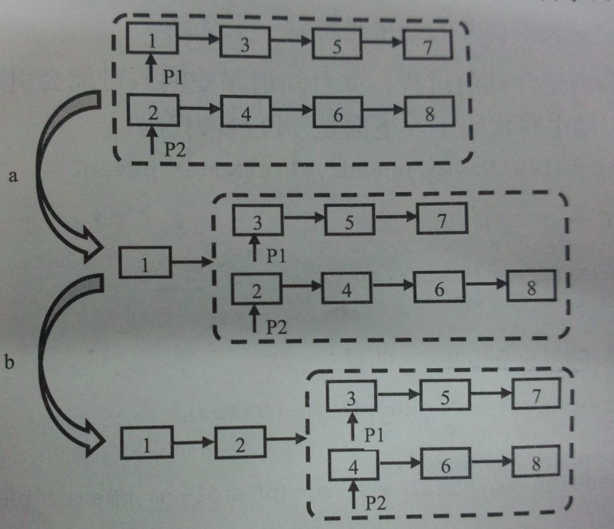

## 题目描述

输入两个单调递增的链表，输出两个链表合成后的链表，当然我们需要合成后的链表满足单调不减规则。


### 1. 方法一：递归法 (很优雅)




```
思路：
当合并完前两个结点之后，剩下的结点仍然是有序的，合并的步骤和之前的步骤相同，自然要想到使用【递归】来完成。
```

```java
// 牛客网通过

/*
public class ListNode {
    int val;
    ListNode next = null;

    ListNode(int val) {
        this.val = val;
    }
}*/
public class Solution {
    public ListNode Merge(ListNode list1,ListNode list2) {
        if (list1 == null)
            return list2;
        if (list2 == null)
            return list1;

        ListNode mergeList = null;
        if (list1.val <= list2.val)
        {
            mergeList = list1;
            list1 = list1.next;
            mergeList.next = Merge(list1, list2); // 递归
        }
        else
        {
            mergeList = list2;
            list2 = list2.next;
            mergeList.next = Merge(list1, list2); // 递归
        }
        return mergeList;
    }
}
```

### 本地测试完整代码

```java
class ListNode{
    int val;
    ListNode next = null;
    ListNode(int val)
    {
        this.val = val;
    }
}

public class MergeList {
    public static void main(String[] args) {
        int[] arr1 = {1, 3, 5};
        int[] arr2 = {2, 4, 6};
        ListNode list1 = createList(arr1);
        ListNode list2 = createList(arr2);
        printList(list1);
        printList(list2);


        // 合并两个排号序的list
        ListNode mergeList = Merge2(list1, list2);
        printList(mergeList);

    }

    public static ListNode createList(int[] arr)
    {
        ListNode head = new ListNode(arr[0]);
        ListNode tail = head;
        for (int i = 1; i < arr.length; i++)
        {
            ListNode nowNode = new ListNode(arr[i]);
            tail.next = nowNode;
            tail = tail.next;
        }
        return head;
    }

    public static void printList(ListNode head)
    {
        while (head != null)
        {
            if (head.next == null)
                System.out.println(head.val);
            else
                System.out.print(head.val + "-->");
            head = head.next;
        }
    }

    public static ListNode Merge2(ListNode list1,ListNode list2)
    {
        if (list1 == null)
            return list2;
        if (list2 == null)
            return list1;

        ListNode mergeList = null;
        if (list1.val <= list2.val)
        {
            mergeList = list1;
            list1 = list1.next;
            mergeList.next = Merge2(list1, list2);
        }
        else
        {
            mergeList = list2;
            list2 = list2.next;
            mergeList.next = Merge2(list1, list2);
        }
        return mergeList;
    }
}

/* 运行结果：

1-->3-->5
2-->4-->6
1-->2-->3-->4-->6

*/
```

